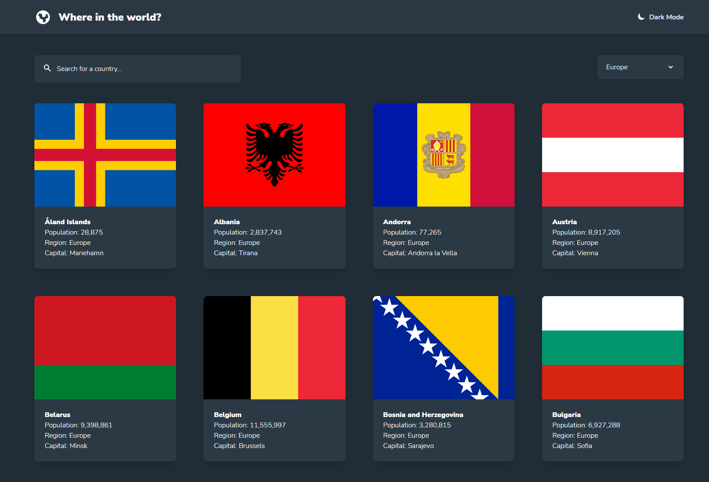
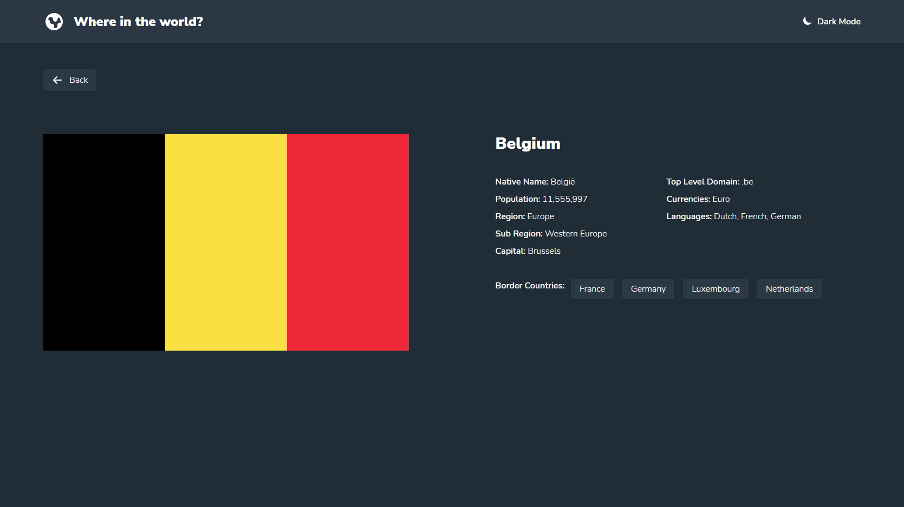

# Frontend Mentor - REST Countries API with color theme switcher solution

This is a solution to the [REST Countries API with color theme switcher challenge on Frontend Mentor](https://www.frontendmentor.io/challenges/rest-countries-api-with-color-theme-switcher-5cacc469fec04111f7b848ca). Frontend Mentor challenges help you improve your coding skills by building realistic projects. 

## Overview

### The challenge

Users should be able to:

- See all countries from the API on the homepage
- Search for a country using an `input` field
- Filter countries by region
- Click on a country to see more detailed information on a separate page
- Click through to the border countries on the detail page
- Toggle the color scheme between light and dark mode *(optional)*

### Screenshot

### Links

- Solution URL: [Add solution URL here](https://your-solution-url.com)
- Live Site URL: [Add live site URL here](https://your-live-site-url.com)

## My process

### Stack

- React (UI and Components)
- Next.js (Dynamic Routing)
- Tailwind (CSS Framework)

### Focus of the Project

- Next.js dynamic routing
- Client-side fetching
- Filtering data using search field
- Filtering data with dropdown menu
- Next.js getStaticProps and getStaticPaths

## Author

Ian Wu

- Frontend Mentor - [@iannnop](https://www.frontendmentor.io/profile/iannnop)
- LinkedIn - [@iannnop](https://www.linkedin.com/in/iannnop/)
- Instagram - [@iannnop_frontend](https://www.instagram.com/iannnop_frontend/)
- Twitter - [@iannnop](https://www.twitter.com/iannnop)